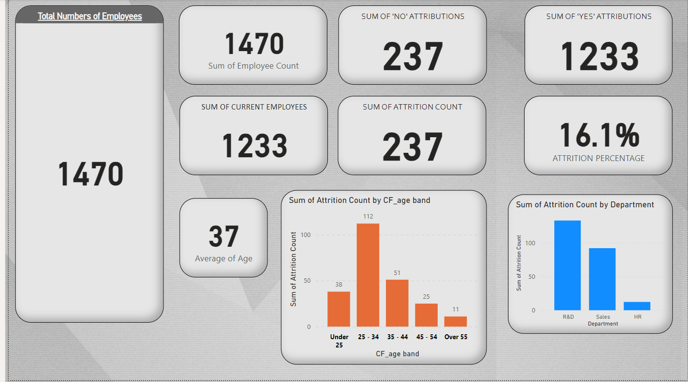
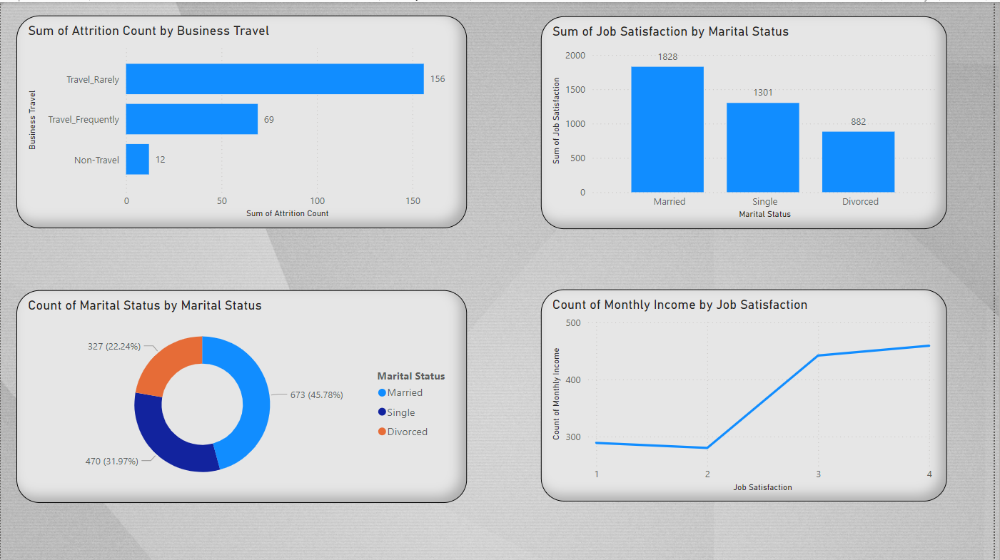

# Company-Attrition-Rate
This address the way an organization lost talents and factors that might be the cause.
***
1.) This report shows the total employees of a company, individuals who left represented in attrition and the department they left from.  
This report also shows the age band of people who left and their average age.

***
2.) This report is trying to show if business travel contributed to the attrition rate, marital status amongst employees, job satisfaction and their monthly income. Also job satisfaftion against marital status.

